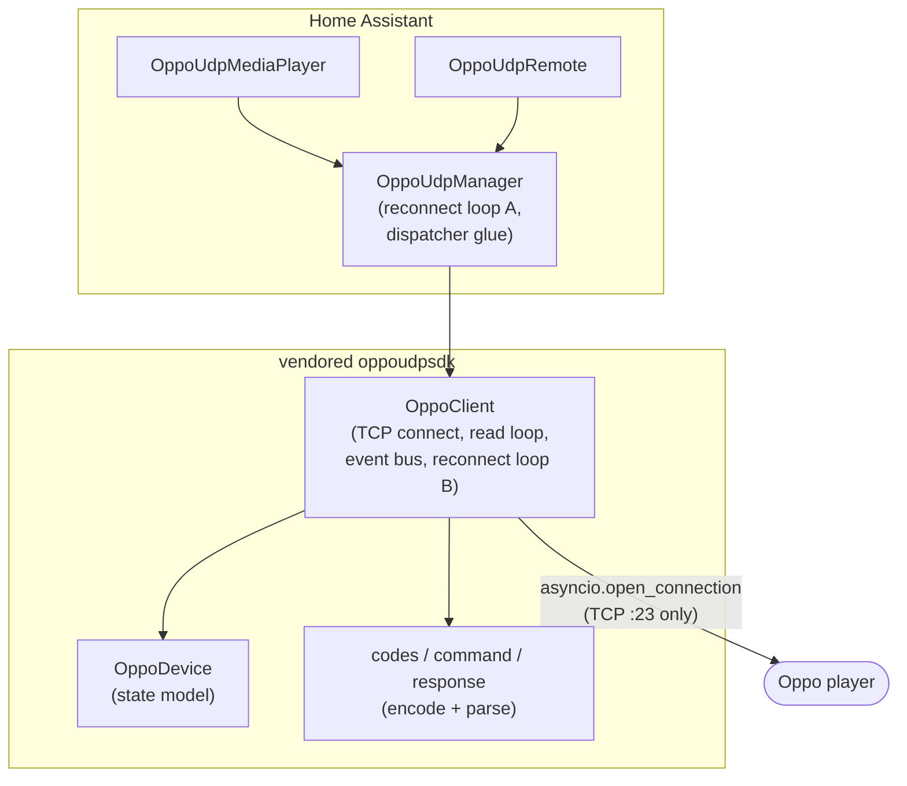
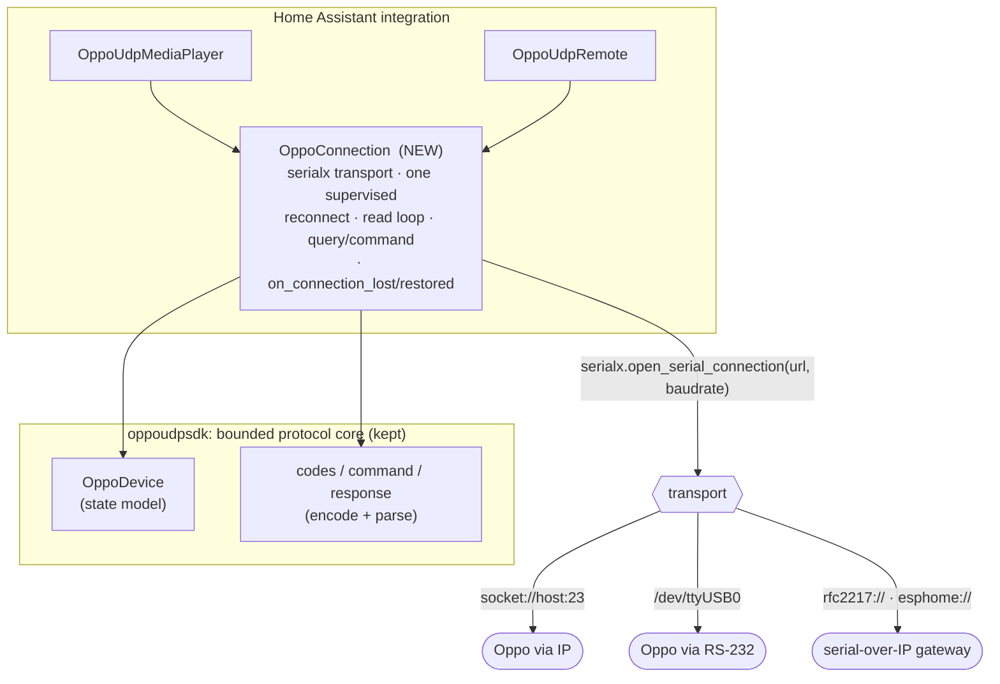
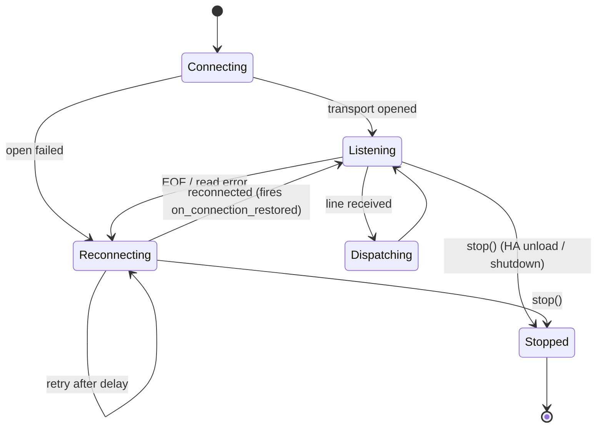
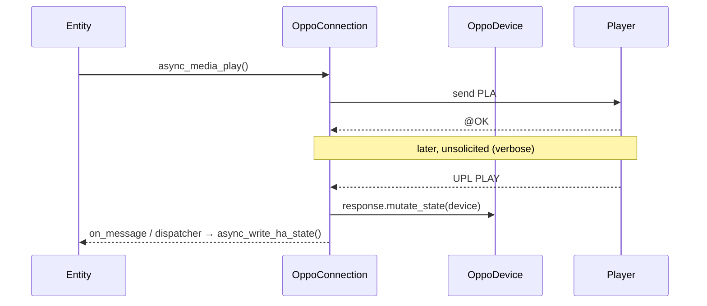

# Architecture

How the Oppo UDP-20x integration is structured, and the **Phase 4** plan to
replace its connection/lifecycle layer with a transport-agnostic one.

- Protocol wire details live in [PROTOCOL.md](PROTOCOL.md).
- This document is the design of record for the Phase 4 refactor; update it as
  the refactor lands.

## Guiding principle

> **Bounded protocol core + HA-native lifecycle.**

The Oppo control protocol splits cleanly into two concerns, and they should live
in two places:

1. **Protocol core** — command encoding, response parsing, the code/enum tables,
   and the device state model. Pure, deterministic, transport-agnostic,
   unit-testable without a socket. *Keep it* (it's the vendored SDK, and the
   protocol-coverage audit found it essentially complete).
2. **Connection lifecycle** — opening a transport, the read loop, reconnection,
   request/response correlation, and surfacing state to Home Assistant. This is
   where every bug and dated pattern lives. *Replace it* with an HA-native class.

The current code draws the boundary in the wrong place: connection lifecycle is
split across the vendored SDK's `OppoClient` **and** the integration's
`OppoUdpManager`, which each run their own reconnect logic.

## Current architecture (as-is)

**Problems this creates**

| Issue | Where |
|-------|-------|
| Two reconnect strategies that interleave at the edges | `OppoUdpManager.async_reconnect` + `OppoClient.async_run_client` |
| Fire-and-forget events (`asyncio.ensure_future`, exceptions swallowed) | `OppoClient.async_event` |
| Broken `remove_event_handler` (uses builtin `callable`) | `OppoClient` |
| `datetime.utcnow()` (deprecated) | `OppoDevice` |
| Bare/blind `except:` in hot paths | `OppoClient`, `OppoDevice`, `OppoUdpManager` |
| IP-only transport — no serial / serial-over-IP | `OppoClient` |
| Untestable connection layer (real sockets) | `OppoClient`, `OppoUdpManager` |

## Target architecture (to-be)

- **`OppoManager`/`OppoUdpManager` is retired.** Its responsibilities (owning the
  connection, reconnect, dispatching to entities) fold into `OppoConnection` plus
  the config-entry `runtime_data` wiring.
- **`OppoClient`'s connection/event/reconnect layer is retired.** The protocol
  pieces it used (`command`, `response`, `codes`, `OppoDevice`) remain.
- **One reconnect loop, one read loop, one event path.**

`OppoConnection` is modeled directly on the maintainer's `ha-anthemav-serial`
`AnthemClient`, which already solves this shape in production.

## Transport model — `serialx`

`serialx.open_serial_connection(url=…, baudrate=…)` mirrors
`asyncio.open_connection` and returns the same `(StreamReader, StreamWriter)`
pair, dispatching on the URL scheme. **The Oppo's IP port 23 is simply the
`socket://` case**, so today's behavior is preserved while native serial and
serial-over-IP come for free through one code path.

| serialx URL | Reaches the player via |
|-------------|------------------------|
| `socket://<host>:23` | IP control (today's default) |
| `/dev/ttyUSB0` (+ baud 9600) | native RS-232 |
| `rfc2217://<host>:<port>` | RFC2217 serial gateway |
| `esphome://<host>:<port>` | ESPHome serial bridge |

`baudrate` is required by serialx but only meaningful for native serial (9600
8N1 for the Oppo per [PROTOCOL.md](PROTOCOL.md)); the TCP schemes ignore it.

Framing is unchanged and owned by the protocol core: commands are `#CCC …\r`,
responses `@OK`/`@ER …\r`, verbose pushes `U** …`.

## Connection lifecycle

`OppoConnection` responsibilities (each mirrors an `AnthemClient` method):

- **`connect()`** — `serialx.open_serial_connection`, guarded by a connect-lock so
  a lazy reconnect in `send()` can't race the supervisor.
- **`_supervise()` → `_listen()` → `_reconnect()`** — the single reconnect loop.
  `_listen` reads lines and dispatches; on drop it fires `on_connection_lost`,
  reconnects, then fires `on_connection_restored` so entities re-query (the
  device only pushes on change).
- **`send(command)`** — write `#…\r`; lazy-connect if needed.
- **`query_one(command, match=…)`** — send and await the first matching response
  via a `(matcher, future)` pair (replaces the SDK's fragile command-lock).
- **`request_query()` / `_drain_queries()`** — pace queued state queries (the Oppo
  caps commands at ~25 bytes and asks callers to "allow time for processing", so
  startup/power-on query bursts are spaced out).
- Verbose (`SVM 3`) is enabled on connect so `U**` pushes drive live updates;
  `UTC` gives per-second position.

## Protocol core (kept, lightly hardened)

Retained from the vendored SDK, with targeted fixes made *after* the connection
layer is swapped (each behind the harness):

- `codes.py`, `command/`, `response/` — encoders/parsers (unchanged).
- `OppoDevice` — the state model. Fed parsed responses by `OppoConnection`;
  its own `async_event` bus is no longer used.
- Fixes: `datetime.utcnow()` → `datetime.now(UTC)`; audit every enum **value**
  against [PROTOCOL.md](PROTOCOL.md) (the `HOME_MENU` class); replace bare/blind
  excepts; make an unknown status string **skip**, not raise (defensive parsing).

## Config flow & migration

- **New/reconfigure:** a transport menu (`socket` / `rfc2217` / `esphome` /
  `serial`), following the `anthemav_serial` pattern. Network schemes build
  `{scheme}://{host}:{port}` (default port 23); `serial` takes a device path +
  baud. The chosen `serialx` URL is stored in entry data.
- **Migration:** existing entries hold `{host, port}`. On load, if no `url` is
  present, synthesize `socket://{host}:{port}` — no user action, no re-add.
- **Entity `unique_id` is unchanged** (still `entry_id`; there is no hardware
  serial — see PROTOCOL.md), so history and customizations are preserved.

## Home Assistant wiring

- Typed `OppoConfigEntry = ConfigEntry[OppoConnection]`; the connection lives in
  `entry.runtime_data` (already the pattern post-Phase 2).
- Entities register `on_connection_lost` / `on_connection_restored` /
  message handlers via the connection; state changes call `async_write_ha_state`.
- Background tasks use `entry.async_create_background_task` (cancelled on unload),
  replacing the manager's untracked `hass.loop.create_task`.

## Testing strategy

The harness added in Phase 3.5 is the safety net. New work is covered by:

- A **fake transport** — a scripted `(reader, writer)` — so `OppoConnection` is
  unit-tested without a socket: connect, read/dispatch, reconnect on EOF,
  `query_one` matching, paced draining, lost/restored callbacks.
- The existing **service-method guard** (every media_player/remote service hits a
  real device method) continues to guard the entity↔core boundary.
- Config-flow tests extend to the transport menu + the `socket://` migration.
- Coverage ratchets up as `manager.py`'s per-file-ignores disappear with it.

## Incremental delivery

Each step is a reviewable PR that keeps `master` shippable.

1. **`OppoConnection` + fake-transport tests** — add the class and `serialx`
   dependency; not yet wired in. Pure addition.
2. **Swap in `OppoConnection`, retire `OppoUdpManager`** — IP-only
   (`socket://host:23`), behavior-preserving. Removes reconnect duplication.
3. **Config-flow transport menu + `socket://` migration** — still defaults to IP.
4. **Harden the retained core** — `datetime`, enum-value audit + defensive
   parsing, excepts; drop the now-dead `OppoClient` connection/event code.
5. **Expose serial / rfc2217 / esphome** in the UI + docs; hardware-test each.

## Risks & mitigations

| Risk | Mitigation |
|------|------------|
| Big refactor with limited hardware time | Fake-transport tests + behavior-preserving IP-first swap; hardware-test at step 2 before adding transports |
| New dependency (`serialx`) just after removing one | Small, purpose-built, already shipped in `anthemav_serial`; pinned + mirrored in `requirements.test.txt` |
| Verbose-push state model differs subtly from today | Keep `OppoDevice` as-is; only its feeder changes; assert parity against `0.2.0` behavior |
| Existing entries break on upgrade | `socket://{host}:{port}` migration on load; `unique_id` unchanged |

## Open decisions

- **Where `OppoConnection` lives** — integration module (`connection.py`) vs.
  inside the vendored SDK. Leaning integration, to keep the SDK a pure protocol
  core and the lifecycle HA-native.
- **How far to trim the vendored SDK** in step 4 (delete `client.py`/`states.py`
  outright vs. leave dormant). Prefer deleting dead code once nothing imports it.
- **Coordinator vs. bespoke callbacks** — `AnthemClient`-style callbacks are the
  baseline; revisit `DataUpdateCoordinator` only if it simplifies push handling.
